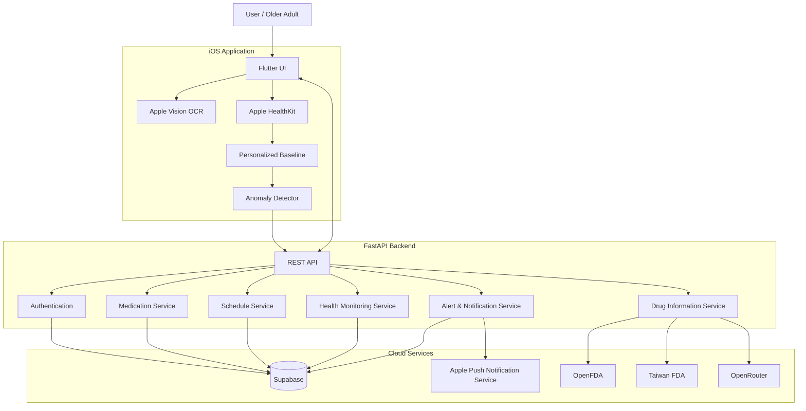

# MediGuard (MAIC)

[English](README.md) | [繁體中文](README.zh-TW.md)

> **AI-assisted medication management and post-dose health monitoring for older adults.**

MediGuard is a mobile health application designed to help users manage medications, understand drug information, track medication schedules, and monitor physiological changes after taking medication.

The system combines a **Flutter mobile application**, **FastAPI backend**, **Supabase**, and native Apple technologies including **Vision OCR** and **HealthKit**. Medication information can be enriched using external drug databases, while post-dose physiological measurements are analyzed against a personalized baseline to identify potential anomalies.

> [!IMPORTANT]
> MediGuard is currently a research and prototype system. It is **not a medical device** and must not be used as a substitute for professional medical advice, diagnosis, treatment, or emergency care.

---

## Features

### Medication Recognition

- Capture or select medication package images on iPhone
- Perform on-device OCR using **Apple Vision**
- Extract medication text without uploading the original image for OCR
- Convert OCR results into editable medication drafts
- Enrich medication information using:
  - OpenFDA
  - Taiwan FDA
  - AI-assisted medication information processing

### Medication Management

- User authentication
- Medication creation and management
- Medication schedules
- Taken / skipped medication records
- Medication history
- Drug information and warning display
- Secure API communication with authenticated backend endpoints

### Post-dose Health Monitoring

After a medication dose is recorded, MediGuard can start a monitoring session and collect available physiological data from **Apple HealthKit**.

Currently supported measurements include:

- Heart rate
- Heart rate variability (HRV / SDNN)
- Oxygen saturation (SpO₂)

The application maintains a personalized rolling baseline and compares new observations against the user's historical measurements.

### Anomaly Detection

The current implementation provides personalized rule-based anomaly detection.

Possible anomaly types include:

- High heart rate
- Low oxygen saturation
- Irregular HRV
- Combined physiological abnormalities

The native module returns:

- anomaly level
- anomaly type
- confidence
- physiological deviations
- backend-compatible anomaly payload

> Core ML-based anomaly detection is planned but is **not yet implemented**.

### Apple Watch Integration

Health samples can include metadata describing their source:

- Apple Watch
- iPhone
- merged sources
- unknown sources

When Apple Watch measurements have synchronized with HealthKit on the iPhone, MediGuard can access those samples through HealthKit.

Direct real-time Apple Watch streaming with WatchConnectivity is planned as future work.

### Alerts and Notifications

The backend provides infrastructure for:

- health anomaly reporting
- active health event tracking
- alert resolution
- APNs push notification tokens
- medication reminder scheduling
- emergency / escalation service integration

---

## System Architecture



---

## End-to-End Workflow

```text
Medication Image
       │
       ▼
Apple Vision OCR
       │
       ▼
Medication Draft
       │
       ├──── Drug Information Enrichment
       │          ├── OpenFDA
       │          └── Taiwan FDA
       │
       ▼
Create Medication
       │
       ▼
Create Medication Schedule
       │
       ▼
User Takes Medication
       │
       ▼
Record Medication Log
       │
       ▼
Start HealthKit Monitoring
       │
       ▼
Collect HR / HRV / SpO₂
       │
       ▼
Compare with Personalized Baseline
       │
       ▼
Anomaly Detection
       │
       ├── Normal
       │
       └── Potential Anomaly
                  │
                  ▼
          Send Event to Backend
                  │
                  ▼
          Alert / Notification Flow
```

---

## Technology Stack

| Layer | Technologies |
|---|---|
| Mobile App | Flutter, Dart |
| State Management | Riverpod |
| Routing | GoRouter |
| HTTP Client | Dio |
| Secure Storage | Flutter Secure Storage |
| Native iOS | Swift |
| OCR | Apple Vision |
| Health Monitoring | Apple HealthKit |
| Backend | FastAPI, Python |
| Database | PostgreSQL |
| Backend Platform | Supabase |
| Authentication | Supabase Auth |
| File Storage | Supabase Storage |
| Drug Information | OpenFDA, Taiwan FDA |
| AI Service | OpenRouter |
| Push Notifications | APNs |
| Python Package Management | uv |
| API Documentation | OpenAPI / Swagger |

---

## Repository Structure

```text
MAIC/
│
├── apple_native/
│   ├── Sources/
│   │   └── AppleNativeKit/
│   │       ├── OCR/
│   │       ├── Health/
│   │       ├── ML/
│   │       ├── Watch/
│   │       ├── Bridge/
│   │       └── Shared/
│   ├── Tests/
│   ├── docs/
│   ├── Package.swift
│   └── README.md
│
├── backend/
│   ├── app/
│   │   ├── api/
│   │   ├── core/
│   │   ├── db/
│   │   ├── models/
│   │   └── services/
│   ├── scripts/
│   ├── supabase/
│   │   └── migration.sql
│   ├── tests/
│   ├── .env.example
│   ├── main.py
│   ├── pyproject.toml
│   └── README.md
│
├── frontend/
│   ├── ios/
│   ├── lib/
│   │   ├── app/
│   │   ├── apple_native/
│   │   ├── backend/
│   │   ├── core/
│   │   ├── features/
│   │   │   ├── auth/
│   │   │   ├── compliance/
│   │   │   ├── dashboard/
│   │   │   ├── health/
│   │   │   ├── profile/
│   │   │   └── scan/
│   │   └── l10n/
│   ├── test/
│   ├── pubspec.yaml
│   └── README.md
│
├── shared/
│
└── README.md
```

---

## Getting Started

### Prerequisites

#### Backend

- Python 3.12+
- `uv`
- Supabase project
- OpenRouter API key

#### iOS / Flutter

- Flutter SDK
- Dart SDK
- Xcode
- CocoaPods where required
- Apple Developer configuration for device capabilities
- Physical iPhone recommended for HealthKit testing

Optional production features may additionally require:

- APNs authentication credentials
- Apple Watch paired with the test iPhone

---

## Backend Setup

### 1. Enter the backend directory

```bash
cd backend
```

### 2. Create the environment configuration

```bash
cp .env.example .env
```

Configure the required values:

```env
SUPABASE_URL=
SUPABASE_SERVICE_KEY=

OPENROUTER_API_KEY=

APNS_KEY_ID=
APNS_TEAM_ID=
APNS_BUNDLE_ID=
APNS_KEY_PATH=
APNS_USE_SANDBOX=true

APP_ENV=development
SCHEDULER_ENABLED=true
APP_TIMEZONE=Asia/Taipei
SECRET_KEY=
```

Do **not** commit `.env`, Supabase service keys, APNs private keys, or other credentials to the repository.

### 3. Install dependencies

```bash
uv sync
```

### 4. Initialize the database

Run:

```text
backend/supabase/migration.sql
```

in the Supabase SQL Editor.

The migration initializes the application's main tables, including:

```text
users
medications
schedules
medication_logs
health_events
alert_logs
```

It also configures indexes, Row Level Security, and supporting database behavior.

### 5. Start the backend

For local development:

```bash
uv run uvicorn main:app --reload
```

To allow an iPhone on the same local network to connect:

```bash
uv run uvicorn main:app --host 0.0.0.0 --port 8000 --reload
```

Useful development endpoints:

```text
/health
/docs
```

> When testing on a physical iPhone, do not configure the application to use `localhost` or `127.0.0.1` as the backend address. Use the development machine's LAN IP address.

---

## Flutter Application Setup

### 1. Enter the frontend directory

```bash
cd frontend
```

### 2. Install Flutter dependencies

```bash
flutter pub get
```

### 3. Check the environment

```bash
flutter doctor
```

### 4. Start the application

```bash
flutter devices
flutter run
```

For native HealthKit functionality, testing with a physical iPhone is recommended.

---

## Apple Native Module

Apple-specific functionality is implemented under:

```text
apple_native/
```

### OCR

```text
Sources/AppleNativeKit/OCR/
```

Uses Apple Vision for on-device medication text recognition.

### Health Monitoring

```text
Sources/AppleNativeKit/Health/
```

Responsible for:

- requesting HealthKit permissions
- retrieving physiological measurements
- creating health snapshots
- maintaining monitoring sessions
- recording measurement-source metadata
- maintaining personalized baselines

### Anomaly Detection

```text
Sources/AppleNativeKit/ML/
```

The current predictor compares recent physiological observations against personalized historical baselines.

The implementation is currently **rule-based**.

### Flutter Bridge

```text
Sources/AppleNativeKit/Bridge/
```

Provides stable communication contracts between Flutter and native Swift functionality.

Supported bridge operations include:

- OCR
- image selection
- HealthKit permissions
- monitoring start / stop
- health snapshots
- personalized baseline retrieval
- anomaly prediction
- model status
- structured native errors

Additional native documentation is available under:

```text
apple_native/docs/
```

---

## Core Backend API

The primary API is versioned under:

```text
/api/v1/
```

### Authentication

```http
POST /api/v1/auth/login
```

Authenticated endpoints expect a bearer access token:

```text
Authorization: Bearer <access_token>
```

### Drug Information

```http
POST /api/v1/medications/drug-info
```

Drug information lookup aggregates available information from OpenFDA and Taiwan FDA.

### Medication

```http
POST /api/v1/medications
```

### Schedule

```http
POST /api/v1/schedules
```

### Medication Log

```http
POST /api/v1/logs/taken
```

The response includes information required to start the post-dose monitoring session, such as:

```text
log_id
monitoring_start
monitoring_end
monitoring_duration_seconds
```

### Report Health Anomaly

```http
POST /api/v1/health/anomaly
```

Example anomaly types:

```text
high_hr
low_spo2
irregular_hrv
combined
```

Current anomaly levels:

```text
0 = normal
1 = warning
2 = high-risk anomaly
```

### Monitoring Status

```http
GET /api/v1/health/status/{log_id}
```

### Resolve Alert

```http
POST /api/v1/health/resolve
```

---

## Testing

### Backend Tests

```bash
cd backend
uv run pytest
```

### Native Swift Tests

Tests are located under:

```text
apple_native/Tests/AppleNativeKitTests/
```

### Flutter Tests

```bash
cd frontend
flutter test
```

---

## Current Development Status

### Implemented

- [x] Flutter iOS application architecture
- [x] Supabase authentication
- [x] Medication management
- [x] Medication scheduling
- [x] Taken / skipped medication logs
- [x] Apple Vision OCR
- [x] Medication OCR-to-draft workflow
- [x] OpenFDA drug information lookup
- [x] Taiwan FDA drug information lookup
- [x] HealthKit permission handling
- [x] Heart-rate collection
- [x] HRV collection
- [x] SpO₂ collection
- [x] Physiological source metadata
- [x] Personalized rolling baseline
- [x] Rule-based personalized anomaly detection
- [x] Health anomaly backend reporting
- [x] Health event status tracking
- [x] Alert resolution flow
- [x] APNs token infrastructure
- [x] Reminder scheduler bootstrap
- [x] Flutter ↔ native Swift bridge
- [x] End-to-end testing on a physical iPhone

### In Progress / Future Work

- [ ] Core ML anomaly detection
- [ ] Learned personalized anomaly model
- [ ] Direct WatchConnectivity streaming
- [ ] More advanced activity-aware health interpretation
- [ ] Improved Apple Watch real-time integration
- [ ] More comprehensive automated testing
- [ ] Production-grade alert escalation
- [ ] Expanded medication interaction analysis
- [ ] Production UI/UX refinement
- [ ] Clinical validation

---

## Privacy and Security

MediGuard processes sensitive health-related information, so security and privacy should be considered throughout development.

Current design principles include:

- Apple Vision OCR executes on-device
- Health data is accessed through Apple's HealthKit permission model
- authentication is handled through Supabase
- authenticated backend APIs use bearer tokens
- secrets are stored in environment configuration rather than source code
- database access should be protected through Row Level Security
- only necessary health information should be persisted

Developers should never commit:

```text
.env
APNs private keys
Supabase service keys
OpenRouter API keys
access tokens
private health datasets
```

---

## Important Medical Disclaimer

MediGuard is currently developed as a research and prototype software project.

The software:

- does not provide a medical diagnosis
- does not replace physicians or pharmacists
- does not guarantee detection of adverse drug reactions
- must not be relied upon during a medical emergency
- has not been established as a certified medical device

Physiological anomaly detection should therefore be interpreted only as an experimental decision-support function.

For urgent medical situations, users should contact qualified healthcare professionals or local emergency services.

---

## Documentation

More detailed documentation is available in:

```text
backend/README.md
apple_native/README.md
apple_native/docs/
```

---

## Contributing

Contributions should follow the existing separation of concerns:

```text
frontend       → cross-platform UI and application logic
apple_native   → Apple-specific OCR, HealthKit, ML, and bridge logic
backend        → REST APIs, persistence, medication services, and alerts
shared         → shared contracts or resources
```

When adding features:

1. Keep API and native bridge contracts backward compatible where possible.
2. Add tests for new backend or native behavior.
3. Never commit credentials or personal health information.
4. Clearly distinguish experimental medical logic from clinically validated functionality.
5. Update documentation when API contracts or architecture change.

---

## Project Status

**Research / Prototype — Active Development**

The project has a working end-to-end iOS prototype, including medication OCR, medication management, HealthKit monitoring, personalized baseline calculation, anomaly reporting, and backend persistence.

The next major technical milestones are **learned personalized anomaly detection**, stronger **Apple Watch integration**, and **production-level validation**.
