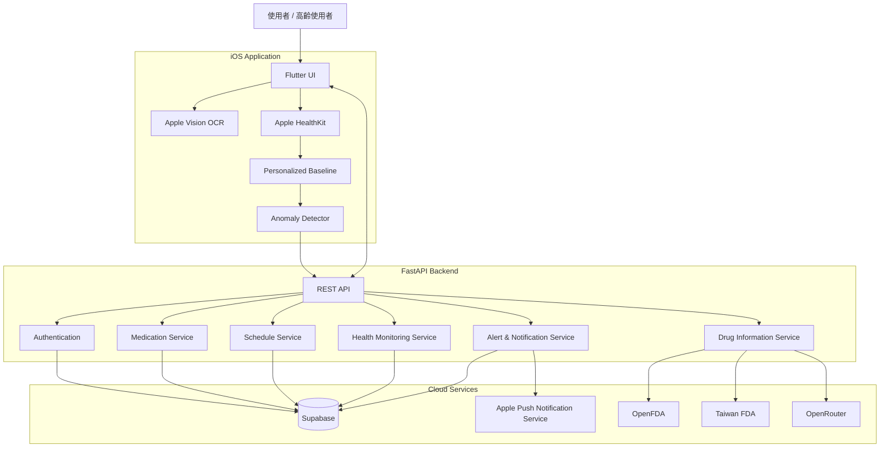

# MediGuard（MAIC）

[English](README.md) | [繁體中文](README.zh-TW.md)

> **結合 AI 輔助的智慧用藥管理與服藥後健康監測系統**

MediGuard 是一套行動健康應用程式，主要協助使用者管理藥物、了解藥品資訊、追蹤服藥時程，並在服藥後持續監測生理狀態變化。

本系統整合 **Flutter 行動應用程式**、**FastAPI 後端**、**Supabase**，以及 Apple 原生技術，包括 **Vision OCR** 與 **HealthKit**。系統亦可串接外部藥品資料庫補充藥物資訊，並根據使用者個人的歷史生理基準，分析服藥後的健康量測資料，以辨識潛在異常。

> [!IMPORTANT]
> MediGuard 目前屬於研究與原型開發階段，**並非醫療器材**，不得用於取代專業醫療建議、診斷、治療或緊急醫療處置。

---

## 功能特色

### 藥品辨識

- 使用 iPhone 拍攝或選取藥品包裝圖片
- 使用 **Apple Vision** 執行裝置端 OCR
- OCR 過程無需上傳原始藥品圖片
- 將 OCR 辨識結果轉換為可編輯的藥品草稿
- 透過以下來源補充藥品資訊：
  - OpenFDA
  - Taiwan FDA
  - AI 輔助藥品資訊處理

### 用藥管理

- 使用者登入與身分驗證
- 新增與管理藥品
- 建立服藥時程
- 記錄已服藥／略過服藥
- 查看服藥歷史
- 顯示藥物資訊與相關警示
- 透過驗證後端 API 進行安全資料傳輸

### 服藥後健康監測

當使用者完成服藥紀錄後，MediGuard 可啟動健康監測階段，並透過 **Apple HealthKit** 取得可用的生理量測資料。

目前支援的健康指標包括：

- Heart Rate（心率）
- Heart Rate Variability，HRV / SDNN（心率變異性）
- Oxygen Saturation，SpO₂（血氧飽和度）

系統會維護個人化的 rolling baseline，並將最新生理量測值與使用者過去的歷史健康資料進行比較。

### 異常偵測

目前系統實作個人化的 rule-based anomaly detection。

可辨識的異常類型包括：

- 心率過高
- 血氧過低
- HRV 異常
- 多項生理訊號同時異常

原生模組可回傳：

- anomaly level
- anomaly type
- confidence
- physiological deviations
- 與後端相容的 anomaly payload

> Core ML-based anomaly detection 已列入後續開發規劃，但目前**尚未實作完成**。

### Apple Watch 整合

健康資料可保留量測來源資訊，例如：

- Apple Watch
- iPhone
- 多來源合併
- 未知來源

當 Apple Watch 的健康量測資料同步至 iPhone HealthKit 後，MediGuard 即可透過 HealthKit 取得相關資料。

目前尚未實作透過 WatchConnectivity 進行 Apple Watch 即時串流，此功能列為未來開發項目。

### 警示與通知

後端目前提供以下相關功能架構：

- 健康異常事件回報
- Active health event 狀態管理
- Alert resolution
- APNs Push Notification Token
- 服藥提醒排程
- 緊急警示／升級通知服務介面

---

## 系統架構



---

## End-to-End Workflow

目前已於實體 iPhone 驗證的完整流程如下：

```text
藥品圖片
    │
    ▼
Apple Vision OCR
    │
    ▼
Medication Draft
    │
    ├──── 藥品資訊補充
    │          ├── OpenFDA
    │          └── Taiwan FDA
    │
    ▼
建立藥品資料
    │
    ▼
建立服藥時程
    │
    ▼
使用者服藥
    │
    ▼
建立服藥紀錄
    │
    ▼
啟動 HealthKit Monitoring
    │
    ▼
取得 HR / HRV / SpO₂
    │
    ▼
與 Personalized Baseline 比較
    │
    ▼
Anomaly Detection
    │
    ├── Normal
    │
    └── Potential Anomaly
               │
               ▼
       回報 Backend
               │
               ▼
       Alert / Notification Flow
```

---

## 技術架構

| Layer | Technologies |
|---|---|
| Mobile App | Flutter, Dart |
| State Management | Riverpod |
| Routing | GoRouter |
| HTTP Client | Dio |
| Secure Storage | Flutter Secure Storage |
| Native iOS | Swift |
| OCR | Apple Vision |
| Health Monitoring | Apple HealthKit |
| Backend | FastAPI, Python |
| Database | PostgreSQL |
| Backend Platform | Supabase |
| Authentication | Supabase Auth |
| File Storage | Supabase Storage |
| Drug Information | OpenFDA, Taiwan FDA |
| AI Service | OpenRouter |
| Push Notifications | APNs |
| Python Package Management | uv |
| API Documentation | OpenAPI / Swagger |

---

## Repository Structure

```text
MAIC/
│
├── apple_native/
│   ├── Sources/
│   │   └── AppleNativeKit/
│   │       ├── OCR/
│   │       ├── Health/
│   │       ├── ML/
│   │       ├── Watch/
│   │       ├── Bridge/
│   │       └── Shared/
│   ├── Tests/
│   ├── docs/
│   ├── Package.swift
│   └── README.md
│
├── backend/
│   ├── app/
│   │   ├── api/
│   │   ├── core/
│   │   ├── db/
│   │   ├── models/
│   │   └── services/
│   ├── scripts/
│   ├── supabase/
│   │   └── migration.sql
│   ├── tests/
│   ├── .env.example
│   ├── main.py
│   ├── pyproject.toml
│   └── README.md
│
├── frontend/
│   ├── ios/
│   ├── lib/
│   │   ├── app/
│   │   ├── apple_native/
│   │   ├── backend/
│   │   ├── core/
│   │   ├── features/
│   │   │   ├── auth/
│   │   │   ├── compliance/
│   │   │   ├── dashboard/
│   │   │   ├── health/
│   │   │   ├── profile/
│   │   │   └── scan/
│   │   └── l10n/
│   ├── test/
│   ├── pubspec.yaml
│   └── README.md
│
├── shared/
│
└── README.md
```

---

## 快速開始

### 環境需求

#### Backend

- Python 3.12+
- `uv`
- Supabase project
- OpenRouter API key

#### iOS / Flutter

- Flutter SDK
- Dart SDK
- Xcode
- 視需求安裝 CocoaPods
- Apple Developer 相關裝置權限設定
- 建議使用實體 iPhone 進行 HealthKit 測試

若需要完整 Production 功能，可能還需要：

- APNs authentication credentials
- 與測試 iPhone 配對的 Apple Watch

---

## Backend Setup

### 1. 進入 backend 目錄

```bash
cd backend
```

### 2. 建立環境設定檔

```bash
cp .env.example .env
```

設定必要環境變數：

```env
SUPABASE_URL=
SUPABASE_SERVICE_KEY=

OPENROUTER_API_KEY=

APNS_KEY_ID=
APNS_TEAM_ID=
APNS_BUNDLE_ID=
APNS_KEY_PATH=
APNS_USE_SANDBOX=true

APP_ENV=development
SCHEDULER_ENABLED=true
APP_TIMEZONE=Asia/Taipei
SECRET_KEY=
```

請勿將 `.env`、Supabase service key、APNs private key 或其他敏感憑證提交至 Git Repository。

### 3. 安裝套件

```bash
uv sync
```

### 4. 初始化資料庫

將：

```text
backend/supabase/migration.sql
```

於 Supabase SQL Editor 中執行。

Migration 會建立主要資料表，包括：

```text
users
medications
schedules
medication_logs
health_events
alert_logs
```

同時也會建立 Indexes、Row Level Security 與相關資料庫設定。

### 5. 啟動 Backend

本機開發：

```bash
uv run uvicorn main:app --reload
```

若需要讓同一區域網路中的實體 iPhone 存取：

```bash
uv run uvicorn main:app --host 0.0.0.0 --port 8000 --reload
```

常用開發端點：

```text
/health
/docs
```

> 使用實體 iPhone 測試時，不可將 Backend Address 設定為 `localhost` 或 `127.0.0.1`。請改用電腦在區域網路中的 LAN IP。

---

## Flutter Application Setup

### 1. 進入 frontend 目錄

```bash
cd frontend
```

### 2. 安裝 Flutter dependencies

```bash
flutter pub get
```

### 3. 檢查 Flutter 環境

```bash
flutter doctor
```

### 4. 啟動應用程式

```bash
flutter devices
flutter run
```

若要測試 HealthKit 相關功能，建議使用實體 iPhone。

---

## Apple Native Module

Apple 平台相關功能獨立實作於：

```text
apple_native/
```

### OCR

```text
Sources/AppleNativeKit/OCR/
```

使用 Apple Vision 執行裝置端藥品文字辨識。

### Health Monitoring

```text
Sources/AppleNativeKit/Health/
```

主要功能包含：

- 要求 HealthKit permissions
- 取得生理量測資料
- 建立 health snapshot
- 管理 health monitoring session
- 紀錄 measurement source metadata
- 維護 personalized baseline

### Anomaly Detection

```text
Sources/AppleNativeKit/ML/
```

目前 predictor 會將最新的健康量測資料與使用者個人歷史 baseline 進行比較。

現階段採用 **rule-based anomaly detection**。

### Flutter Bridge

```text
Sources/AppleNativeKit/Bridge/
```

用於 Flutter 與 Swift 原生功能之間的穩定資料交換。

目前支援：

- OCR
- 圖片選擇
- HealthKit permissions
- 啟動／停止 monitoring
- health snapshots
- personalized baseline
- anomaly prediction
- model status
- structured native errors

更多 Apple Native 文件位於：

```text
apple_native/docs/
```

---

## 主要 Backend API

主要 API 使用以下版本前綴：

```text
/api/v1/
```

### Authentication

```http
POST /api/v1/auth/login
```

需要驗證的 API 需加入：

```text
Authorization: Bearer <access_token>
```

### Drug Information

```http
POST /api/v1/medications/drug-info
```

藥品查詢會整合 OpenFDA 與 Taiwan FDA 中可取得的資訊。

### Medication

```http
POST /api/v1/medications
```

### Schedule

```http
POST /api/v1/schedules
```

### Medication Log

```http
POST /api/v1/logs/taken
```

回傳內容包含啟動服藥後健康監測所需的資訊，例如：

```text
log_id
monitoring_start
monitoring_end
monitoring_duration_seconds
```

### Report Health Anomaly

```http
POST /api/v1/health/anomaly
```

目前支援的 anomaly type 例如：

```text
high_hr
low_spo2
irregular_hrv
combined
```

目前 anomaly level 定義：

```text
0 = normal
1 = warning
2 = high-risk anomaly
```

### Monitoring Status

```http
GET /api/v1/health/status/{log_id}
```

### Resolve Alert

```http
POST /api/v1/health/resolve
```

---

## Testing

### Backend Tests

```bash
cd backend
uv run pytest
```

### Native Swift Tests

測試位於：

```text
apple_native/Tests/AppleNativeKitTests/
```

### Flutter Tests

```bash
cd frontend
flutter test
```

---

## 目前開發進度

### 已完成

- [x] Flutter iOS 應用程式架構
- [x] Supabase Authentication
- [x] 藥品管理
- [x] 服藥時程管理
- [x] 已服藥／略過服藥紀錄
- [x] Apple Vision OCR
- [x] 藥品 OCR-to-draft workflow
- [x] OpenFDA 藥品資料查詢
- [x] Taiwan FDA 藥品資料查詢
- [x] HealthKit permission handling
- [x] 心率資料取得
- [x] HRV 資料取得
- [x] SpO₂ 資料取得
- [x] 生理量測來源 metadata
- [x] Personalized rolling baseline
- [x] Rule-based personalized anomaly detection
- [x] Health anomaly backend reporting
- [x] Health event status tracking
- [x] Alert resolution flow
- [x] APNs token infrastructure
- [x] Reminder scheduler bootstrap
- [x] Flutter ↔ Swift native bridge
- [x] 實體 iPhone End-to-End 測試

### 開發中／未來規劃

- [ ] Core ML anomaly detection
- [ ] Learned personalized anomaly model
- [ ] Direct WatchConnectivity streaming
- [ ] Activity-aware health interpretation
- [ ] 更完整的 Apple Watch 即時整合
- [ ] 更完整的 automated testing
- [ ] Production-grade alert escalation
- [ ] 藥物交互作用分析
- [ ] Production UI/UX refinement
- [ ] Clinical validation

---

## 隱私與資訊安全

MediGuard 涉及健康相關敏感資料，因此系統開發過程中需特別重視隱私與安全。

目前系統設計原則包括：

- Apple Vision OCR 於裝置端執行
- HealthKit 資料遵循 Apple HealthKit 權限模型
- 使用 Supabase 執行 Authentication
- Backend API 使用 bearer token 驗證
- API Key 與密鑰透過環境變數管理
- Database Access 透過 Row Level Security 保護
- 僅保存系統真正需要的健康資料

開發者不得提交以下內容：

```text
.env
APNs private keys
Supabase service keys
OpenRouter API keys
access tokens
private health datasets
```

---

## 醫療免責聲明

MediGuard 目前僅作為研究與 Prototype Software Project 使用。

本系統：

- 不提供醫療診斷
- 不取代醫師或藥師
- 不保證能偵測所有藥物不良反應
- 不可用於醫療緊急情況判斷
- 尚未被認證為醫療器材

因此，目前的生理異常偵測功能僅應被視為實驗性 decision-support 功能。

若發生緊急健康狀況，使用者應立即聯絡合格醫療專業人員或當地緊急醫療服務。

---

## Documentation

更詳細的技術文件位於：

```text
backend/README.md
apple_native/README.md
apple_native/docs/
```

---

## Contributing

開發時建議遵循目前既有的模組職責分離：

```text
frontend       → Cross-platform UI 與 Application Logic
apple_native   → Apple-specific OCR、HealthKit、ML 與 Bridge
backend        → REST APIs、資料儲存、藥品服務與 Alerts
shared         → Shared contracts 或共用資源
```

新增功能時：

1. 在可行範圍內維持 API 與 Native Bridge backward compatibility。
2. 為新的 Backend 或 Native 行為新增測試。
3. 不得提交任何 Credential 或 Personal Health Information。
4. 清楚區分實驗性醫療邏輯與已完成臨床驗證的功能。
5. API Contract 或系統架構修改後應同步更新文件。

---

## 專案狀態

**Research / Prototype — Active Development**

目前專案已完成可運作的 iOS End-to-End Prototype，包含：

- 藥品 OCR
- 藥品管理
- HealthKit 健康監測
- Personalized Baseline
- 健康異常偵測與回報
- Backend Persistence
- Alert Flow

下一階段主要技術目標為 **Learned Personalized Anomaly Detection、強化 Apple Watch 整合，以及 Production-level Validation**。
