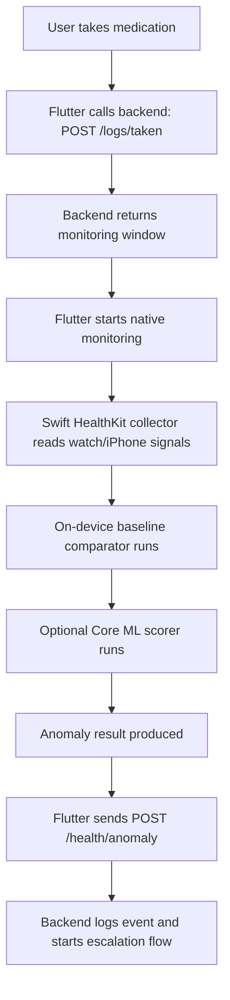

# Personalized Anomaly Detection

## Overview
MediGuard should avoid using a single fixed threshold for every user. A heart rate that is normal for one person may be abnormal for another, especially for older adults with different health conditions, activity levels, and medication responses.

The recommended MVP approach is:

1. collect personal baseline data on-device
2. compare post-medication health signals against that baseline
3. trigger anomaly detection when the deviation is large enough
4. send only the anomaly result to the backend

This keeps the system private, practical, and much easier to ship than full on-device retraining in the first version.

## Product Goal
The goal is not only to detect dangerous changes after taking medication, but to detect changes relative to the user's own normal state.

Target outcomes:

- fewer false positives than global thresholds
- better sensitivity to unusual reactions for each user
- privacy-preserving health analysis on device
- a credible path toward more advanced personalization later

## Recommended Strategy
### Phase 1: Personalized Baseline
Instead of retraining a model immediately, the app should first learn a personal baseline for each user.

The app collects normal health data over an initial observation period and uses that data to establish:

- resting heart rate range
- typical heart rate variation by time of day
- heart rate variability baseline
- normal SpO2 range if available
- normal recovery pattern after activity if available

This baseline becomes the reference point for anomaly checks after medication intake.

### Phase 2: Lightweight Personalization
Once the baseline exists, the app should keep refining it over time using a rolling window.

Recommended improvements:

- update baseline using the last 7 to 14 days of normal data
- exclude periods marked as illness, anomaly, or unusually intense activity
- separate daytime and nighttime behavior when useful
- treat pre-medication and post-medication periods differently

### Phase 3: Advanced On-Device Adaptation
If the team has more time, the project can later explore deeper personalization such as:

- threshold tuning per user
- online calibration of model outputs
- lightweight on-device adaptation of a generic Core ML model

This should be treated as an advanced phase, not an MVP dependency.

## Why Not Full On-Device Retraining First
The phrase "on-device training" sounds powerful, but for an MVP it creates unnecessary complexity.

Risks of jumping there too early:

- hard to validate with limited user data
- harder to debug false positives and false negatives
- difficult to explain in a hackathon or MVP demo
- more engineering work across HealthKit, model lifecycle, and testing

For this project, a strong baseline-driven detector is the better first step.

## Baseline Collection Window
The system should not try to learn a stable baseline from only 1 to 2 days of data.

Recommended windows:

- minimum: 3 to 7 days
- preferred: 7 to 14 days

Reason:

- heart rate changes across sleep, activity, stress, caffeine, and time of day
- elderly users may have large day-to-day variation
- very short windows are more vulnerable to noise

## Suggested Input Signals
Primary signals for MVP:

- heart rate
- heart rate variability
- blood oxygen saturation if available
- timestamp
- whether the user recently took medication

Optional context signals:

- activity level
- walking or workout state
- sleep status
- medication category
- time since medication intake

## Detection Logic For MVP
The simplest useful version is a hybrid approach:

- personalized baseline
- a few medically cautious rules
- optional small anomaly score

Example logic:

1. user marks medication as taken
2. app starts a monitoring window, for example 2 hours
3. app samples HealthKit data during that window
4. current values are compared with personal baseline
5. if deviation crosses threshold, app flags an anomaly

Example triggers:

- heart rate significantly above resting baseline for a sustained duration
- heart rate variability drops sharply relative to recent median
- SpO2 falls below a personal or safety threshold
- multiple moderate deviations happen together after medication

## Recommended Output
The on-device detector should produce a small structured result:

```json
{
  "medication_log_id": "uuid",
  "anomaly_level": 2,
  "anomaly_type": "tachycardia",
  "core_ml_confidence": 0.82,
  "timestamp": "2026-05-06T18:00:00Z"
}
```

This matches the backend flow already in place:

- `POST /api/v1/logs/taken`
- `POST /api/v1/health/anomaly`
- `GET /api/v1/health/status/{log_id}`
- `POST /api/v1/health/resolve`

## Proposed Apple-Native Flow


## Engineering Recommendation
For the Apple-native implementation, the team should build in this order:

1. HealthKit data collection
2. monitoring window handling
3. baseline storage and update logic
4. rule-based anomaly detection
5. optional Core ML scoring layer
6. optional advanced personalization

This order keeps the system testable and demoable at each step.

## What To Say In Demo Or Pitch
Recommended wording:

- "We do not use one fixed threshold for every user."
- "MediGuard learns each user's personal baseline on-device."
- "Potential adverse reactions are detected by measuring deviation from that user's normal state after medication intake."
- "This approach is more privacy-preserving and more personalized for elderly care."

## Success Criteria
This direction is successful if:

- the app can build a personal baseline locally
- the app can detect post-medication deviations using that baseline
- anomaly results can be sent to backend reliably
- false positives are lower than a naive global-threshold approach
- the system remains understandable enough for demo and judging

## Conclusion
Personalization is the right direction for MediGuard, but the MVP should start with a personalized baseline rather than full on-device retraining.

That gives the project:

- a stronger health story
- a more realistic implementation path
- better privacy alignment
- a cleaner bridge between Apple-native code and backend escalation
